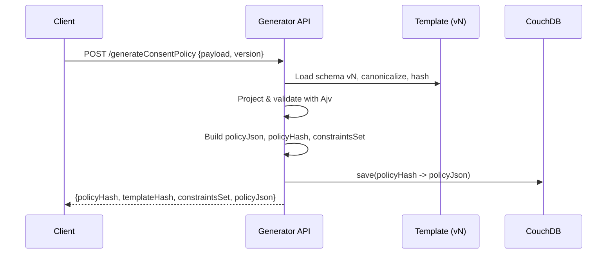
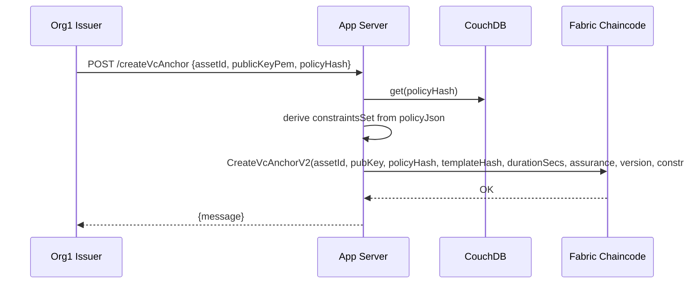
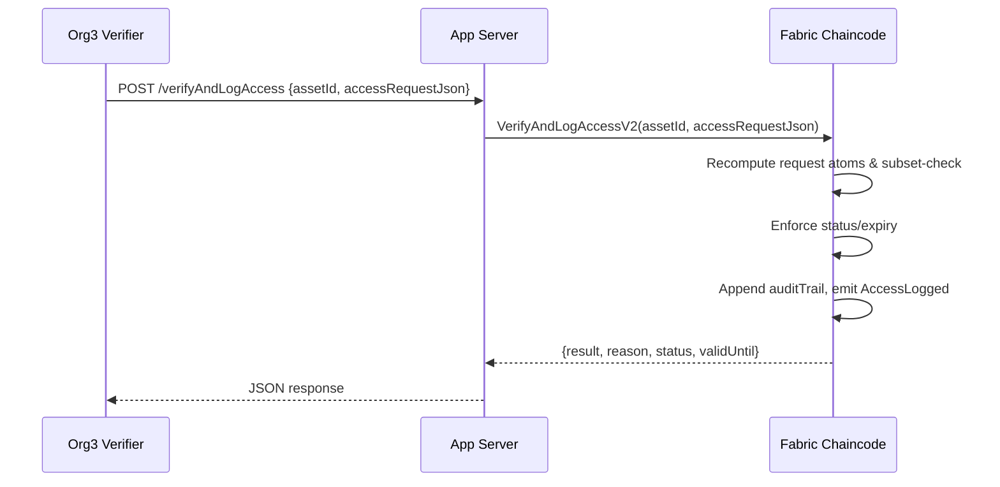

# Consentis T4.3 — Smart Contract Generator & Finder

> **Goal**: Deliver the *Smart Contract Generator* (policy generator + template engine) and the *Finder* (on‑chain verifier with audit logging) so AEGIS fully covers GA task **T4.3**.

---

## 1) Architecture at a Glance

* **Templates (v3, v4, …)**: JSON Schema files (`src/templates/v*.json`) define allowed policy fields (e.g., `purposes`, `operations`, `durationSecs`, `legalFlags.freelyGiven`, …).
* **Generator API** (`/generateConsentPolicy`):

  * Projects `req.body` onto the selected template.
  * Validates with Ajv.
  * Builds canonical **policyJson**, computes **policyHash** & **templateHash**.
  * Derives **constraintsSet** (privacy‑preserving atom hashes) used by chaincode.
  * Stores `policyJson` in CouchDB using `_id = policyHash`.
* **Issuer (Org1) → Anchor Create** (`CreateVcAnchorV2`):

  * Reads `policyJson` by `policyHash`, passes `constraintsSet` to chaincode.
  * Chaincode stores anchor with `constraintsSet`, `validUntil`, `assuranceLevel`, etc.
* **Verifier (Org3) → Verify & Log** (`VerifyAndLogAccessV2`):

  * Sends `accessRequestJson` (purpose/operation/constraints).
  * Chaincode recomputes request atoms and checks **subset** against `constraintsSet`.
  * Always logs allow/deny (audit trail), emits `AccessLogged` event.

---

## 2) Data Artifacts

### Policy JSON (off‑chain)

Minimal example (v4):

```json
{
  "purposes": ["pcode001"],
  "operations": ["ocode001"],
  "durationSecs": 31536000,
  "assuranceLevel": "AL3",
  "legalFlags": { "freelyGiven": true },
  "templateHash": "<sha256 of canonical template>"
}
```

Derived:

* **policyHash** = SHA256(canonical(policyJson)) → used as CouchDB `_id`.
* **constraintsSet** = array of atom hashes. Each atom = `SHA256(key + SEP + canonical(value))`, `SEP = "\u001F"`.

### Anchor (on‑chain)

Stored fields (simplified):

```json
{
  "docType": "vcAnchor",
  "assetId": "<ID>",
  "creator": "Org1",
  "holderBindingHash": "<sha256(pubKeyPem)>",
  "policyHash": "<policyHash>",
  "templateHash": "<hash>",
  "templateVersion": "v4",
  "validUntil": "<ISO>",
  "assuranceLevel": "AL3",
  "constraintsSet": ["<atom1>", "<atom2>", ...],
  "status": "active",
  "createdTimestamp": "<ISO>",
  "auditTrail": [ { "timestamp":"<ISO>", "revoked":false, "txId":"..." } ]
}
```

---

## 3) Endpoints & Payloads

### 3.1 POST `/generateConsentPolicy`

**Body (v4)**:

```json
{
  "purposes": "pcode001",
  "operations": "ocode001",
  "durationDays": 365,
  "assuranceLevel": "AL3",
  "legalFlags": { "freelyGiven": true },
  "version": "4"
}
```

**Response**:

```json
{
  "policyJson": { ... },
  "policyHash": "<sha256>",
  "templateHash": "<sha256>",
  "templateVersion": "v4",
  "durationSecs": 31536000,
  "assuranceLevel": "AL3",
  "constraintsSet": ["<atom1>", "<atom2>", ...],
  "existed": false
}
```

Notes:

* If `v4` makes `legalFlags` required (via JSON Schema), omitting it fails validation.
* Two payloads that differ by any template field produce different `policyHash` (distinct Couch docs).

### 3.2 POST `/createVcAnchor` (Issuer/Org1)

**Body**:

```json
{
  "assetId": "asset-123",
  "publicKeyPem": "-----BEGIN PUBLIC KEY-----...",
  "policyHash": "<policyHash>"
}
```

**Server steps**:

1. Load `policyJson` by `policyHash` from CouchDB.
2. (Re)derive `constraintsSet` from `policyJson`.
3. Submit Fabric tx:

```
CreateVcAnchorV2(
  assetId,
  publicKeyPem,
  policyHash,
  templateHash,
  String(durationSecs),
  assuranceLevel || '',
  templateVersion,
  JSON.stringify(constraintsSet)
)
```

**Response**: `{ "message": "VC anchor for asset-123 created." }`

### 3.3 POST `/verifyAndLogAccess` (Verifier/Org3)

**Body**:

```json
{
  "assetId": "asset-123",
  "accessRequest": "{\"purpose\":[\"pcode001\"],\"operation\":[\"read\"],\"constraints\":{}}"
}
```

**Chaincode**:

* Rebuilds atoms from request using same rules.
* Ensures every request atom ∈ `constraintsSet`.
* Checks `status/validUntil`.
* Appends audit log and emits `AccessLogged`.
  **Response**:

```json
{
  "result": true,
  "reason": null,
  "status": "active",
  "validUntil": "<ISO>"
}
```

(Denials set `result:false` and a `reason`, but still log.)

---

## 4) Sequence Diagrams

### 4.1 Policy Generation & Storage



### 4.2 Anchor Creation (Issuer)



### 4.3 Verification & Logging (Verifier)



---

## 5) Implementation Notes

### 5.1 Atomization rules (must be identical off‑chain & on‑chain)

* **Atom**: `SHA256(key + SEP + canonical(value))`, use `SEP = "\u001F"`.
* Strings normalized with `trim().toLowerCase()` where semantic (`purposes`, `operations`, regions, roles).
* Booleans → `"true"|"false"`; numbers → decimal string; arrays → one atom per element; nested objects → flatten with `.` (`legalFlags.freelyGiven`).
* Dedupe + sort atom list for determinism; cap size (e.g., ≤ 64).

### 5.2 Chaincode (new V2 signatures)

* `CreateVcAnchorV2(ctx, assetId, publicKeyPem, policyHash, templateHash, durationSecsStr, assuranceLevel, templateVersion, constraintsSetJson)`
* `VerifyAndLogAccessV2(ctx, assetId, accessRequestJson)`
* Model stores `constraintsSet` (array of hex strings). Audit logs store outcomes (no raw keys/values).

### 5.3 Templates truly drive behavior

* v3 enforces `assuranceLevel ∈ {AL1,AL2,AL3}`.
* v4 can add `legalFlags` and make it required/conditional via JSON Schema.
* Any schema‑recognized difference ⇒ different `policyHash` ⇒ distinct Couch doc.

### 5.4 Security & Privacy

* No raw policy keys/values on chain; only fixed‑length hashes.
* Logs always written (allow or deny) → accountability without PII exposure.
* Holder‑bound revocation: `RevokeVc` verifies Ed25519 signature over `assetId|createdTimestamp`.

---

## 6) Testing Checklist

1. **Generate policies** (Postman):

   * v3 valid (AL1) → success; v3 invalid (AL5) → fail.
   * v4 with/without `legalFlags.freelyGiven` → two different `policyHash`.
2. **Create anchor** (Org1):

   * Feed `assetId`, `publicKeyPem`, `policyHash` → success.
3. **Verify** (Org3):

   * Allowed: `{purpose:["pcode001"], operation:["ocode001"]}` → `result:true`.
   * Denied: `{purpose:["marketing"], operation:["write"]}` → `result:false`, audit logged.
4. **Expiration**: set small `durationSecs`, verify after expiry → `status:"expired"`, denied but logged.

---

## 7) Mapping to GA Task T4.3

* **Generator (ours)**: template‑driven policy creation; canonicalization; hashing; persistence; atom derivation.
* **Finder (ours)**: chaincode subset‑check against `constraintsSet`, expiry/revocation enforcement, and immutable audit logging.
* **Out of scope (Consent Policy Manager UI/workflows)**: optional, our backend remains independent and fully functional without it.

---

## 8) Migration from V1 → V2

* Keep V1 endpoints for backwards compatibility while clients migrate.
* New anchors should use `CreateVcAnchorV2` with `constraintsSetJson`.
* Verifier should call `VerifyAndLogAccessV2` (single JSON string argument) to avoid array params.

---

## 9) Quick Reference (payload shapes)

**/generateConsentPolicy (v4)**

```json
{
  "purposes": "pcode001",
  "operations": "ocode001",
  "durationDays": 365,
  "assuranceLevel": "AL3",
  "legalFlags": { "freelyGiven": true },
  "version": "4"
}
```

**/createVcAnchor (server → chaincode)**

```
CreateVcAnchorV2(
  assetId,
  publicKeyPem,
  policyHash,
  templateHash,
  String(durationSecs),
  assuranceLevel,
  templateVersion,
  JSON.stringify(constraintsSet)
)
```

**/verifyAndLogAccess (verifier)**

```json
{
  "assetId": "asset-123",
  "accessRequest": "{\"purpose\":[\"pcode001\"],\"operation\":[\"read\"],\"constraints\":{}}"
}
```

---

**Done.** This README + diagrams should make it easy for reviewers to see that AEGIS fully covers the Smart Contract Generator (policy/template engine) and Finder (on‑chain verify + audit) per T4.3.
